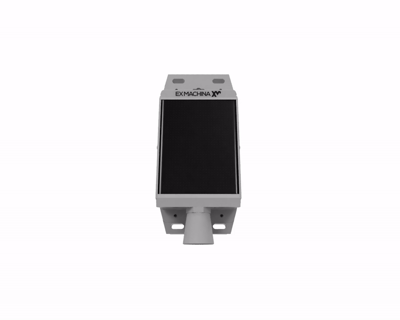
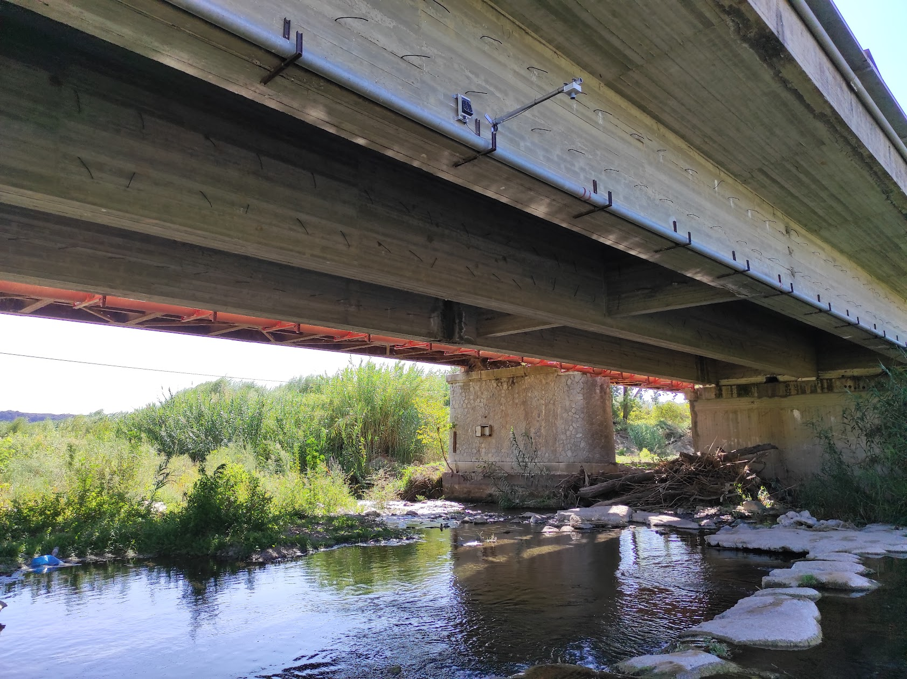
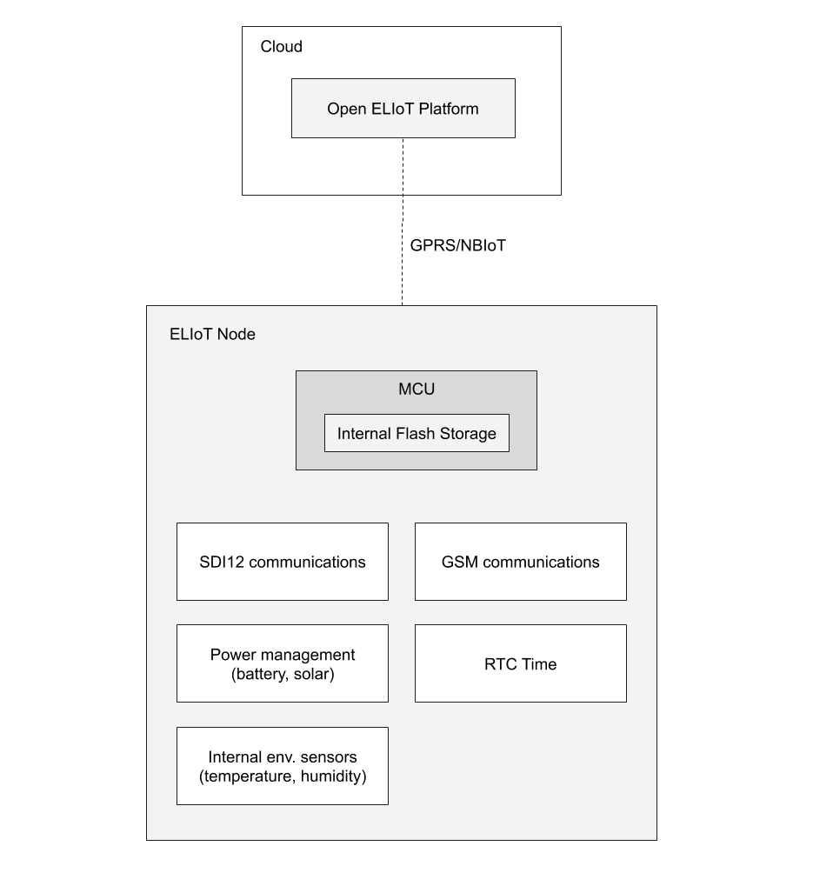

## Εισαγωγή
Το OpenELIoT Νode αποτελεί τον κόμβο καταγραφής δεδομένων από περιβαλλοντικούς αισθητήρες και είναι μέρος του έργου [Open ELIoT](https://github.com/exmgr/OpenELIoT). Αποτελείται από την ίδια την ηλεκτρονική συσκευή καταγραφής και το υλισμικό της το οποίο βρίσκεται σε αυτό το αποθετήριο. 
Είναι ένα αυτόνομα σύστημα καταγραφής κατασκευασμένο να λειτουργεί για μεγάλα χρονικά διαστήματα σε απομακρυσμένες περιοχές αντλώντας ηλιακή ενέργεια για την φόρτιση των μπαταριών του και το περίβλημά του είναι ανθεκτικό στις καιρικές συνθήκες (ήλιος, βροχή, υγρασία).

## Αρχιτεκτονική Node

Το ELIoT node αποτελεί κεντρικό δομικό στοιχείο του κάθε σταθμού καταγραφής OpenELIoT, στον οποίο συνδέονται όλοι οι αισθητήρες των οποίον τα δεδομένα καταγράφει, αποθηκεύει και αποστέλλει στην πλατφόρμα. Αποτελείται από κυκλώματα που του επιτρέπουν να επικοινωνεί μέσω ποικίλων πρωτοκόλλων με τους αισθητήρες, κυκλώματα διαχείρισης ενέργειας για αυτόνομη λειτουργία με φόρτιση των μπαταριών από τον ήλιο και υποστήριξη τεχνολογιών ασύρματης επικοινωνίας για αποστολή των δεδομένων.

## Τεχνικός οδηγός
Αναλυτική περιγραφή του συστήματος, οδηγίες για την κατασκευή, ρύθμιση και τον προγραμματισμού του υλισμικού ενός OpenELIoT Node βρίσκονται στον [τεχνικό οδηγό](docs/technical_guide.pdf)